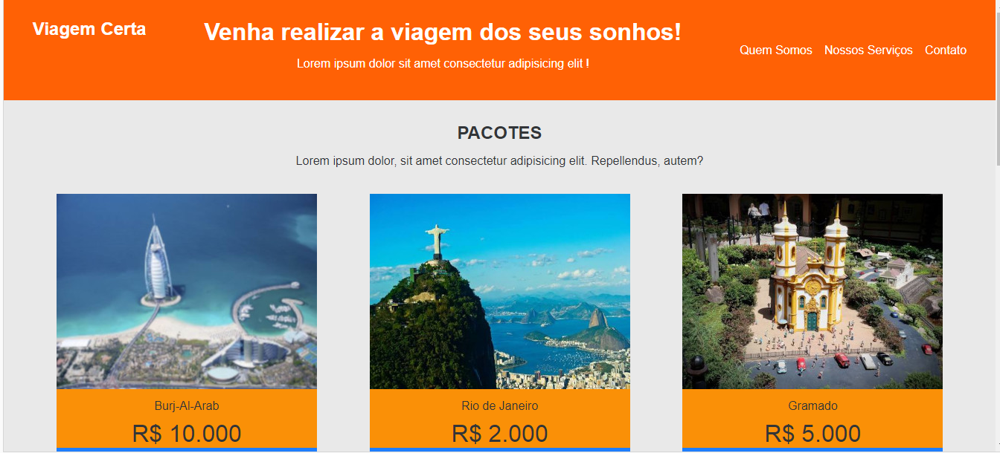

## Agência de Viagens!

**Bem vindos** a mais um projeto feito por mim com muito carinho e dedicação.

## O Projeto

Esse projeto foi feito com base em um projeto de um curso da Plataforma Descomplica. O projeto original foi feito em Bootstrap, como ainda não sei Bootstrap utilizei CSS. O objetivo ao fazer esse projeto foi aperfeiçoar os meus conhecimentos em HTML E CSS, consegui fazer o que era proposto e pretendo adicionar as outras páginas (contato, quem somos e nossos serviços), que no projeto original não foram feitas.

## Onde ver o Projeto

[GitPages](https://crisleine-erculano.github.io/agencia-de-viagens/)

#Linguagens Utilizadas

## Contatos

[Linkedin](https://www.linkedin.com/in/crisleine-erculano)

